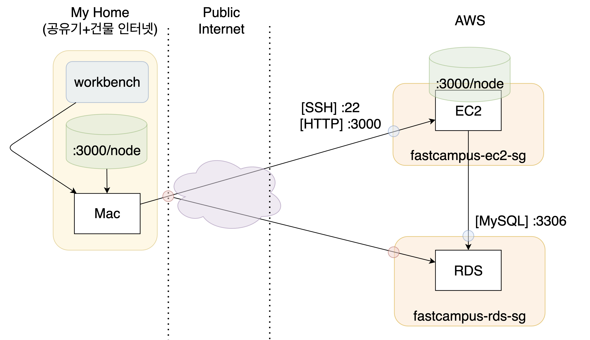

## Ch01. Aws

### 1. Aws 개요
- 클라우드 호스팅  
- 네트워킹을 기반으로 가상 컴퓨터와 스토리지, 네트워크 인프라 등 다양한 서비스를 제공하고 있다.  

```bash
# 서버 접속
1. cd Desktop/
2. chmod 700 test.pem
3. ssh -i test.pem ubuntu@`퍼블릭 IPv4 DNS`

# node.js 설치
1. curl -sL https://deb.nodesource.com/setup_14.x | sudo -E bash -
2. sudo apt-get install -y nodejs
3. node -v # v14.17.6
4. npm -v # 6.14.15

# 서버 오류나면 내렸다가 올려주는 것
sudo npm install -g pm2
pm2 start bin/www # 시작하기
pm2 list # 떠 있는 상태 확인
pm2 stop [i] # 멈추기

# 현위치
pwd

# 사용자
whoami

# 숨긴 권한까지 확인
ls -al

# 우분투 사용자에게 권한 주기
sudo chown ubuntu:ubuntu myproject/

# package.js 열기
vi package.js

# vi 나가기
:wq or :q

# 파일 조회
ll

# 권한 바꾸기
chmod 600 test.pem

# fc

# i > vi에서 입력 버튼


deb https://nginx.org/packages/ubuntu/ bionic nginx 
deb-src https://nginx.org/packages/ubuntu/ bionic nginx
```

  
> 출처: SPONGE-JL님

### 2. NGINX
```bash
1. sudo vi /etc/apt/sources.list
2. sources.list 가 열리면
  deb https://nginx.org/packages/ubuntu/ bionic nginx
  deb-src https://nginx.org/packages/ubuntu/ bionic nginx
  를 마지막에 삽입 후 닫기
3. sudo apt-get update
4. sudo apt-get install nginx
5. sudo service nginx start
6. sudo service nginx status (상태 확인)
7. sudo apt-get purge nginx nginx-common (nginx 완전 삭제)
```